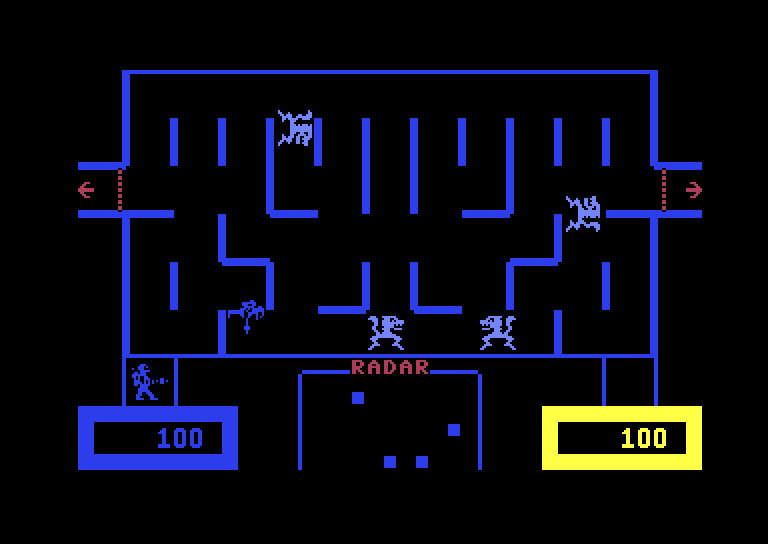
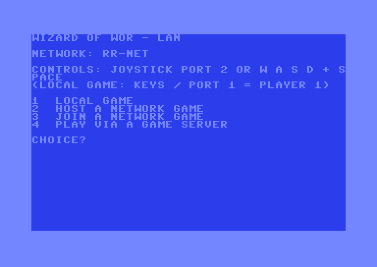
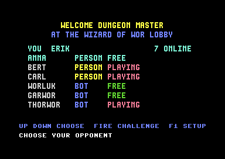
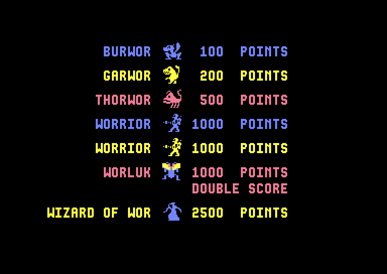
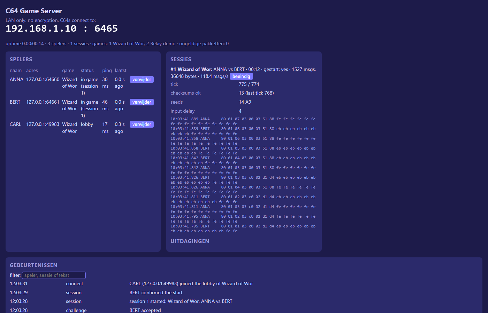

# Wizard of Wor LAN – two Commodore 64s, one dungeon

A network version of **Wizard of Wor** (Commodore, 1983) for the Commodore 64: two players play at the same time on **two separate C64s** connected over the LAN. It runs on the **Commodore 64 Ultimate** (network through its Command Interface) and on **VICE / RR-Net**. It also includes the **C64 Game Server**, a small LAN server that lets C64s find each other and play – the only way two C64 Ultimates can play together.

<p align="center">
  
  
</p>

| Setup menu | Game server lobby | Title screen |
|---|---|---|
|  |  |  |

| C64 Game Server dashboard |
|---|
|  |

## Features

- **The original game, unchanged in look and feel**, rebuilt from the [commented disassembly by dabadab](https://github.com/dabadab/wizardofwor). Every change to the original 16 KB image is a same-size patch, so its layout stays exactly the same.
- **Deterministic, tick-based game logic.** Both C64s run the same simulation and only exchange joystick inputs (lockstep). Verified: a PAL and an NTSC machine produce identical game state checksums over more than 500 seconds of play, including the Worluk and Wizard rounds.
- **Original pace.** The number of actor updates per tick follows a cost model measured on the original NTSC game, so the game keeps its speed – including monsters getting faster when only a few are left. 60 ticks per second on PAL and NTSC.
- **Three ways to play**
  - **Local:** two joysticks, or one joystick plus the keyboard (W A S D + SPACE).
  - **Direct:** VICE/RR-Net hosts, a C64 Ultimate (or another RR-Net) joins. No server needed.
  - **Via the C64 Game Server:** nickname, a lobby screen with everyone online (people and bots), choose your opponent. Needed for C64 Ultimate ↔ C64 Ultimate.
- **Robust networking over UDP:** every input packet repeats the last 16 inputs, packets are resent while waiting, state checksums detect a desync, and a lost opponent sends you back to the title screen.
- **C64 Game Server** (.NET 8, Windows and Raspberry Pi): lobby, challenges, sessions, a relay with checksum checks, a live web dashboard, and a test bot that behaves like a C64.

## Status

| Part | State |
|---|---|
| PRG build, local play | works (VICE) |
| Determinism (PAL vs NTSC) | verified in VICE |
| Direct network play, VICE ↔ VICE | verified (lockstep, identical checksums) |
| C64 Ultimate network driver | measured on real hardware (round trip from 8 ms) |
| C64 Ultimate ↔ VICE, game | built, **not yet tested on real hardware** |
| C64 Game Server + bot | 38 automated tests, bot ↔ bot sessions without errors |
| C64 ↔ C64 Game Server | built, **not yet tested on real hardware** |

## Hardware

| Combination | How |
|---|---|
| C64 Ultimate ↔ VICE / RR-Net | direct (VICE hosts, the Ultimate joins) |
| VICE ↔ VICE | direct |
| C64 Ultimate ↔ C64 Ultimate | via the C64 Game Server |

**Why the server?** The C64 Ultimate firmware cannot listen on a port and cannot open a socket on a fixed local port (checked in the [firmware source](https://github.com/GideonZ/1541ultimate)). Two Ultimates can never reach each other directly, but both can reach a server.

Network notes:
- C64 Ultimate: enable **C64 and Cartridge Settings → Command Interface**.
- VICE: **Settings → Cartridge → Ethernet cartridge**, mode **RR-Net**, with [Npcap](https://npcap.com/) installed. A **wired** network adapter on the PC works best: Wi-Fi access points often drop frames from VICE's extra MAC address.
- VICE usually cannot talk to the PC it runs on (pcap). Run the game server on another machine, for example a Raspberry Pi, when VICE should use it.

## Building

Requirements (Windows):

- Python 3
- WSL with Ubuntu (64tass runs there; the build fetches it from the Ubuntu archive on first use)
- [VICE](https://vice-emu.sourceforge.io/) (cartconv, c1541, and for testing x64sc)
- [cc65](https://cc65.github.io/) (only ca65/ld65, for the ip65 network stack)
- .NET 8 SDK (only for the game server)

Paths to VICE and cc65 are set at the top of `tools/build.py`, or with the environment variables `VICE_DIR` and `CC65_BIN`.

```bash
build.bat
```

This produces, in `build/`:

| File | What |
|---|---|
| `wow.prg` / `wow.d64` | the network version (setup menu, then the game) |
| `wow_cart.crt` | the original cartridge, byte-identical to the disassembly (regression check) |
| `nettest.prg`, `nettest_rrnet.prg` | network measurement tool (C64 Ultimate / RR-Net) |

The game server:

```bash
server\publish.bat
```

## Playing

1. Start `wow` on each C64 (`LOAD"WOW",8,1` and `RUN`, or from the Ultimate menu, or VICE autostart).
2. Choose in the setup menu:
   - **1 LOCAL GAME:** joystick in port 2 for player 2, joystick in port 1 or the keyboard for player 1.
   - **2 HOST A NETWORK GAME** (RR-Net only): enter your IP (or RETURN for DHCP) and wait.
   - **3 JOIN A NETWORK GAME:** enter the host's IP.
   - **4 PLAY VIA A GAME SERVER:** enter a nickname and the server's IP. They are saved as `WOW.CFG` on the disk, so the next start greets you ("Welcome Dungeon Master") and goes straight to the lobby. The lobby screen lists everyone online, person or bot, and whether they are free, busy or playing. Pick an opponent with the joystick (or W/S) and challenge them with FIRE; accept a challenge with FIRE, decline with N. **F1** opens the setup menu to change the name or server.
3. In a network game each player uses joystick port 2 or W A S D + SPACE. The host (or the server) starts the game.

## The C64 Game Server

```bash
server\publish\win-x64\C64GameServer.exe
```

- C64s connect to **UDP port 6465**; the dashboard is at `http://localhost:8080/`.
- **LAN only:** no encryption, no accounts. Never expose it to the internet.
- The server starts three bots (WORLUK, GARWOR, THORWOR) that accept every challenge, so there is always an opponent.
- `C64Bot.exe` plays like a C64, so you can test without hardware.

More in [`server/README.md`](server/README.md) and the protocol in [`server/docs/protocol.md`](server/docs/protocol.md) (both in Dutch).

## Testing tools

| Tool | Purpose |
|---|---|
| `tools/dettest.py` | determinism: PAL and NTSC VICE play the same bot game, checksums compared |
| `tools/netgame_test.py` | network lockstep: VICE host vs VICE join over RR-Net |
| `tools/lobby_view.py` | the lobby screen in VICE with a made-up player list (screenshots) |
| `tools/speedtest.py` | can a C64 keep up with 60 ticks per second? |
| `tools/profile_run.py` | measures the cost of the original game loop (the cost model) |
| `tools/netpeer.py` | PC peer for the network measurement tool |
| `dotnet test server\tests\...` | game server tests (fake clock and network, fuzzing) |

## Project layout

```
src/wizard_of_wor.asm    the game (disassembly + NET: patches)
src/net/game_net.asm     ticks, cost model, determinism, hooks       ($C000)
src/net/netgame.asm      setup menu, network I/O, lockstep, server   ($5D00)
src/net/uci.asm          C64 Ultimate Command Interface driver
src/net/net_rrnet.asm    RR-Net driver on top of ip65 (UDP)
src/net/ip65_glue.s      ip65 jump table and platform glue (ca65)
src/loader.asm           PRG loader
third_party/ip65         ip65 TCP/IP stack (Mozilla Public License)
server/                  the C64 Game Server (.NET 8)
docs/                    design notes and measurements (Dutch)
tools/                   build and test scripts
orig/                    the untouched upstream disassembly
```

## Documentation (Dutch)

- [`docs/netcode.md`](docs/netcode.md) – transport, firmware findings, measurements
- [`docs/fase2_determinisme.md`](docs/fase2_determinisme.md) – how the game was made deterministic
- [`docs/gameserver_onderzoek.md`](docs/gameserver_onderzoek.md) – why the server uses UDP and relays
- [`docs/fase0_meten.md`](docs/fase0_meten.md) – measuring on a C64 Ultimate

## Legal

**Wizard of Wor** is © 1980 Midway Mfg. Co. and © 1983 Commodore. The game code in this repository is based on a reverse-engineered disassembly by [dabadab](https://github.com/dabadab/wizardofwor), which comes without a license. This is a non-commercial hobby project; **no game binaries are distributed** – you build them yourself. If you are a rights holder and object, please open an issue.

The network code, the tools and the C64 Game Server are original work of this project. [ip65](https://github.com/cc65/ip65) is used under the Mozilla Public License 1.1 (see `third_party/ip65/LICENSE.txt`).

## Credits

- Jeff Bruette – the original Commodore 64 Wizard of Wor
- [dabadab](https://github.com/dabadab/wizardofwor) – the commented disassembly
- [ip65](https://github.com/cc65/ip65) – TCP/IP stack for 6502 computers
- [Gideon Zweijtzer](https://github.com/GideonZ/1541ultimate) – the Ultimate firmware
- [ultimate-uci-sdk](https://github.com/barryw/ultimate-uci-sdk) – measured documentation of the Command Interface
