# Commodore 64 Game Server

**Online multiplayer for the Commodore 64.** Two players, each on their own C64,
play together over the network: a real C64 with a **C64 Ultimate / Ultimate 64**
or a **WiC64**, or the **VICE** emulator, in any combination. A small server on
the LAN runs the lobby, pairs the players and relays their joystick inputs.

This repository holds the server, a framework for C64 games, and the games
themselves. Every game is **Online Multiplayer Enabled (OME)**: you start it, see
the lobby with everyone who is online, and choose an opponent, either a person or
one of the server's bots.

<p align="center">
  
  
  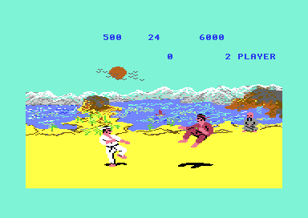
</p>

> **LAN only.** The server has no encryption, accounts or passwords. Never
> forward its ports to the internet.

## Download: the RELEASE folder

Everything to play is in **[RELEASE](RELEASE/README.md)**, ready to run. Download
the repository (*Code → Download ZIP*) and open that folder:

| | |
|---|---|
| `start-server.bat` / `start-server.sh` | The game server for Windows / a Raspberry Pi (no .NET installation needed) |
| `vice-wic64.bat` | Starts VICE with the WiC64 emulation and the game of your choice: the easiest way to play |
| `vice-rrnet.bat` | Starts VICE with an RR-Net cartridge |
| `games/*.d64` | The games, for VICE, a C64 Ultimate or a real disk drive |

## Contents

- [Download: the RELEASE folder](#download-the-release-folder)
- [The games](#the-games)
- [How it works](#how-it-works)
- [What you need](#what-you-need)
- [Quick start](#quick-start)
- [C64 Ultimate: turn on the Command Interface](#c64-ultimate-turn-on-the-command-interface)
- [The lobby (all games)](#the-lobby-all-games)
- [The game server](#the-game-server)
- [Repository layout](#repository-layout)
- [Building and testing](#building-and-testing)
- [Adding a game](#adding-a-game)
- [Documentation](#documentation)
- [Credits and legal](#credits-and-legal)

## The games

| | Game | Id | C64 network | Details |
|---|---|---|---|---|
| 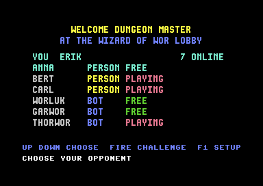 | **Wizard of Wor OME**<br>Two Worriors in the dungeon, 60 ticks per second. The lobby is part of the game. | 1 | Ultimate, WiC64, VICE (WiC64 or RR-Net) | [games/wizardofwor](games/wizardofwor/README.md) |
|  | **Bubble Bobble OME**<br>Bub on one C64, Bob on the other, 25 ticks per second. Uses the framework's standard lobby. | 3 | Ultimate, WiC64, VICE (WiC64 or RR-Net) | [games/bubblebobble](games/bubblebobble/README.md) |
| 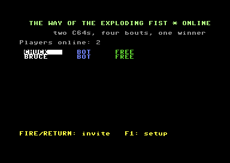 | **The Way of the Exploding Fist OME**<br>White against red, four bouts. The standard lobby and the framework's network code. | 4 | Ultimate, WiC64, VICE (WiC64 or RR-Net) | [games/explodingfist](games/explodingfist/README.md) |

Both games run on the same networks. In VICE the WiC64 emulation is the
simplest: `RELEASE/vice-wic64.bat` sets it up.

Game id 2 is the *Relay demo*: a configuration-only example of a game that needs
no server code (see [Adding a game](#adding-a-game)).

### Wizard of Wor OME

<p align="center">
  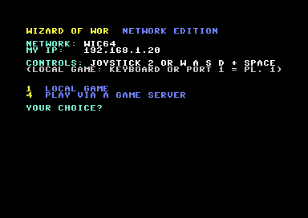
  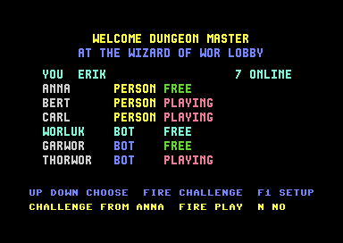
  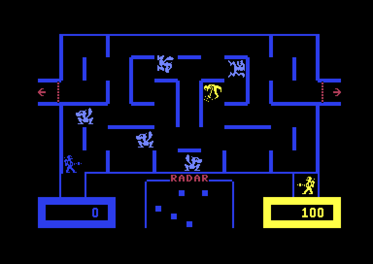
</p>

The original 1983 Commodore game, rebuilt from a commented disassembly. Every change to the
original is a same-size patch. The game was made deterministic and tick based: a PAL
and an NTSC machine produce identical game states. Besides the online play through the server
it can also play **locally** (two joysticks) and **directly** (VICE hosts, a second
machine joins, no server). → [Wizard of Wor OME README](games/wizardofwor/README.md)

### Bubble Bobble OME

<p align="center">
  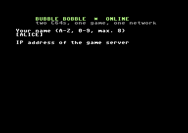
  
  
</p>

The C64 Bubble Bobble (Firebird, 1987), built from the byte-exact
[rebb64](https://github.com/zaidka/rebb64) reconstruction. Game time became
virtual and every session starts from a freshly loaded game file, so both C64s
compute exactly the same game. No byte of the original moves. PAL only.
→ [Bubble Bobble OME README](games/bubblebobble/README.md) ·
[manual](games/bubblebobble/docs/MANUAL.md) ·
[technical description](games/bubblebobble/docs/TECHNICAL.md)

### The Way of the Exploding Fist OME

<p align="center">
  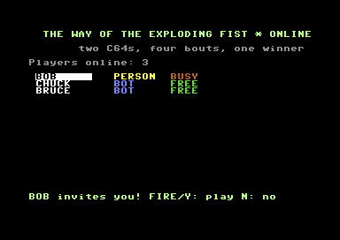
  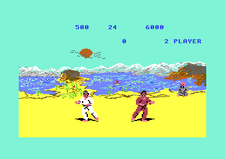
  
</p>

The karate classic by Beam Software (Melbourne House, 1985): the original
two-player match of four bouts, one fighter per C64. There is no source code
of this game: the base is the RAM image its own loader leaves when the game
starts, and every change is a checked patch to it. The boot picture and the
scream are gone; the standard lobby is in front. It is the first game on the
framework's shared network code ([framework/c64/net](framework/c64/net/net.s)).
Deterministic over a whole match on PAL, NTSC and with network-like delays.
→ [Exploding Fist OME README](games/explodingfist/README.md)

## How it works

```
  C64 A (Ultimate)          game server (PC / Raspberry Pi)          C64 B (WiC64)
 ┌──────────────┐  UDP     ┌───────────────────────────────┐   TCP   ┌──────────────┐
 │ game          │◀───────▶│ lobby · invitations · sessions │◀──────▶│ game          │
 │  lockstep     │  inputs │ relay · checksum compare · bots│  inputs │  lockstep     │
 └──────────────┘          │ web dashboard (one tab a game) │         └──────────────┘
        VICE (RR-Net) ◀──raw Ethernet──▶ └───────────────────────────────┘
```

- **Lockstep.** Both C64s run the complete game. Over the network go only the
  joystick inputs, plus a checksum of the game state every 64 ticks. A tick runs
  only when the other player's input for that tick has arrived, so both machines
  compute the same game. Every input message repeats the last 8 or 16 inputs, so
  a lost packet costs nothing.
- **The server is not authoritative.** It does not know the game rules. It runs the
  lobby, starts sessions with a shared seed, relays inputs, compares checksums
  (a difference ends the session with *desync*) and handles timeouts.
- **One protocol for every game.** Message types `$00-$7F` (lobby, sessions, ping)
  are the same for all games; `$80-$FF` belong to the game. See
  [docs/protocol.md](docs/protocol.md).
- **Bots.** The server can run bots for every game. A bot sits in the lobby,
  accepts every challenge and plays real lockstep with random joystick moves, so
  a lone player always has an opponent.

More in [docs/architecture.md](docs/architecture.md).

## What you need

| Player's machine | Network | Notes |
|---|---|---|
| C64 **Ultimate / Ultimate 64** | UDP through the Ultimate Command Interface | **The Command Interface must be enabled**, see [below](#c64-ultimate-turn-on-the-command-interface) |
| C64 + **WiC64** (firmware 2.x) | TCP | |
| **VICE** with WiC64 emulation | TCP | The simplest emulator set-up: `RELEASE/vice-wic64.bat` |
| **VICE** with RR-Net | raw Ethernet (Bubble Bobble) or UDP (Wizard of Wor) | Needs [Npcap](https://npcap.com/): `RELEASE/vice-rrnet.bat`. With Wizard of Wor the server must run on another PC |

Plus **one computer on the LAN for the server**: Windows, Linux or a Raspberry
Pi. The release builds need no .NET installation; from source you need the .NET 8 SDK.

## Quick start

1. **Start the server**: `RELEASE/start-server.bat` (Windows) or `RELEASE/start-server.sh`
   (Raspberry Pi). From source: `cd server` and `dotnet run --project src/C64GameServer -c Release`.

   It prints the IP addresses the C64s can use and writes `server.json` with
   the defaults: all games, with bots for each. The dashboard is at
   http://localhost:8080/. You can also skip this step and play on someone else's server.

2. **Start a C64.**
   - **VICE:** double-click `RELEASE/vice-wic64.bat` and choose a game.
   - **Ultimate, WiC64:** put `RELEASE/games/<game>.d64` on the Ultimate, or on the disk drive.
     On the Ultimate, first turn on the **Command Interface** (see the next section).

3. **Enter your name and the server's IP address** the first time. They are saved on the disk.
   - Any server works.
   - In VICE on the server's own PC, use `127.0.0.1`.
   - Wizard of Wor first shows its menu: choose **4 PLAY VIA A GAME SERVER**.

4. **Choose an opponent** in the lobby, a person or a bot, and press FIRE. Play.

5. **F1** in the lobby opens the setup, to change your name or the server.

## C64 Ultimate: turn on the Command Interface

On a **C64 Ultimate** or **Ultimate 64** the games reach the network through
the Ultimate's **Command Interface**. It is **off by default**. Without it a game
finds no network hardware: Wizard of Wor says *NO NETWORK HARDWARE FOUND*,
Bubble Bobble says *Network: none found*.

1. Open the Ultimate menu (**F2**, or the menu button).
2. Go to **C64 and Cartridge Settings** and set **Command Interface** to **Enabled**.
   The exact place can differ a little between firmware versions.
3. Save the settings, so they are kept after a restart.
4. Connect the Ultimate to your network (LAN, or Wi-Fi on the C64 Ultimate) and
   check in its network settings that it has an IP address.

When it works, the game shows `NETWORK: C64 ULTIMATE` (Wizard of Wor) or
`Network: Ultimate, IP ...` (Bubble Bobble).

## The lobby (all games)

Every OME game has the same kind of lobby. This is a rule of the framework (see
[AI_AGENT.md](AI_AGENT.md)):

| Step | What the player sees |
|---|---|
| Start | The first time it asks for the name and the server's IP address (any server, also someone else's). After that it goes to the lobby by itself. |
| Lobby | **Everyone online for this game**: name, **PERSON** or **BOT**, and **FREE**, **BUSY** or **PLAYING**. |
| Choose | Joystick up/down (or keys) selects, **FIRE** invites. A bot accepts at once. |
| Invited | The bottom line shows who invites you: **FIRE** plays, **N** declines. |
| After the game | Back in the lobby, ready for the next game. |
| Setup | **F1** in the lobby: name and server, or (Wizard of Wor, Bubble Bobble) a local game. |

| Wizard of Wor OME | Bubble Bobble OME |
|---|---|
| 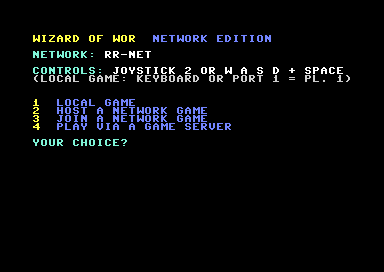 |  |
|  |  |
|  |  |
|  |  |

Wizard of Wor has its lobby inside the game. New games use the framework's
**standard lobby** ([framework/c64/lobby](framework/c64/lobby/README.md)), a
small C program with drivers for the Ultimate, the WiC64 and RR-Net that
loads the game once a session starts. Bubble Bobble uses it.

## The game server

The server (C#, .NET 8) runs on Windows, Linux and a Raspberry Pi. One server
hosts all games at the same time; every player is in the lobby of their own game.

| C64 | Transport | Port |
|---|---|---|
| C64 Ultimate; VICE RR-Net (Wizard of Wor) | UDP | `gamePort` 6465 |
| WiC64 | TCP, `[length][message]` | `tcpPort` 6466 |
| VICE RR-Net (Bubble Bobble) | raw Ethernet, EtherType `0x88B5`, via pcap | `pcapInterface` |

### The dashboard

A live web page on port 8080. Each game has **its own tab** with its players, sessions,
challenges and events. A new game in `server.json` gets a new tab by itself.
The **All games** tab shows everything. You can kick players and end sessions.


| All games | Wizard of Wor tab |
|---|---|
| 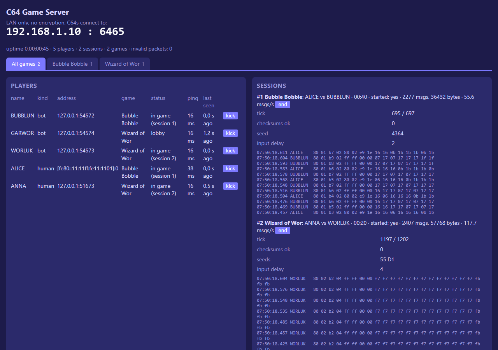 | 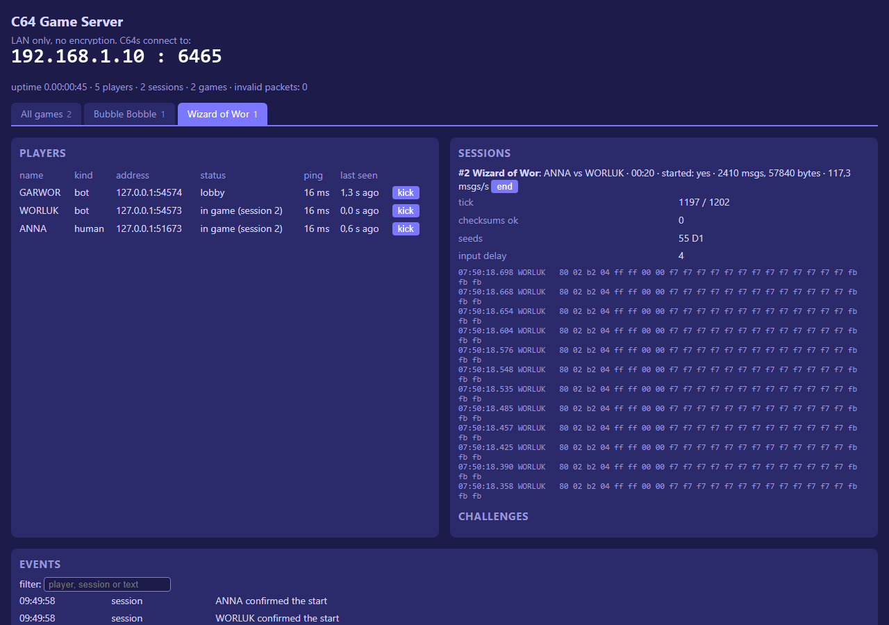 |

### server.json

Written with the defaults at the first start. The main parts:

```json
{
  "gamePort": 6465,
  "tcpPort": 6466,
  "dashboardPort": 8080,
  "pcapInterface": "",
  "games": [
    { "id": 1, "name": "Wizard of Wor", "module": "wizardofwor", "version": 1,
      "bots": ["WORLUK", "GARWOR", "THORWOR"] },
    { "id": 3, "name": "Bubble Bobble", "module": "bubblebobble", "version": 1,
      "bots": ["BUBBLUN", "BOBBLUN"],
      "settings": { "inputDelay": 2, "inputDelayWiC64": 4,
                    "inputTimeoutSeconds": 10, "loadTimeoutSeconds": 150 } },
    { "id": 2, "name": "Relay demo", "module": "relay", "version": 1 }
  ]
}
```

| Setting | Meaning |
|---|---|
| `gamePort` / `tcpPort` | UDP port (Ultimate) / TCP port (WiC64; `0` = off) |
| `dashboardPort` | The web dashboard |
| `pcapInterface` | Network adapter for raw Ethernet (VICE RR-Net); empty = off. `--list-interfaces` lists them |
| `games[].bots` | Built-in bots of this game: they show up in its lobby and accept every challenge |
| `games[].settings` | Settings of the game's server module (see the game's README) |

Details, the firewall and raw Ethernet: [server/README.md](server/README.md).

### Firewall (Windows)

```bash
netsh advfirewall firewall add rule name="C64 Game Server (UDP)" dir=in action=allow protocol=UDP localport=6465
```

```bash
netsh advfirewall firewall add rule name="C64 Game Server (TCP)" dir=in action=allow protocol=TCP localport=6466,8080
```

## Repository layout

```
AI_AGENT.md               rules for AI agents working on this repository (read first)
build.py                  builds and tests everything: server + all games; "release" fills RELEASE/
RELEASE/                  ready to play: server builds, disk images, start scripts (generated, committed)
docs/                     architecture, protocol, adding a game, images
server/                   the game server (C#/.NET 8) and its tests
  src/C64GameServer.Core    core: lobby, sessions, transports, game modules, bots
  src/C64GameServer         the program: config, dashboard, transports
  src/C64Bot                a stand-alone bot that plays like a C64 (testing)
  tests/                    unit tests (fake clock, fake network)
framework/                shared by all games
  c64/lobby/                the standard lobby (cc65): Ultimate, WiC64, RR-Net drivers
  c64/net/                  in-game network code for lockstep games (Ultimate, WiC64, RR-Net)
  c64/packer/               LZ packer with a self-extracting loader
  tools/c64env.py           finds VICE and cc65 for every build and test script
  release/                  start scripts and README for RELEASE/
games/
  wizardofwor/              Wizard of Wor OME   (game.json, README.md, src, tools, docs)
  bubblebobble/             Bubble Bobble OME   (game.json, README.md, src, lobby/game.h, tools, docs)
  explodingfist/            Exploding Fist OME  (game.json, README.md, orig, src, lobby/game.h, tools, docs)
```

Each game folder is self-contained and has a `game.json` (id, module, build
command, disk image, tests) that the root `build.py` reads.

## Building and testing

You need Python 3 and Pillow, the .NET 8 SDK,
[cc65](https://cc65.github.io/) and [VICE](https://vice-emu.sourceforge.io/).
Wizard of Wor also needs WSL with Ubuntu, because 64tass runs there.

The tools are found through
[framework/tools/c64env.py](framework/tools/c64env.py), which tries these in order:

1. the environment variables `VICE_DIR` and `CC65_BIN`;
2. a `paths.local.json` in the repository root, for example `{"VICE_DIR": "C:\\vice\\bin", "CC65_BIN": "C:\\cc65\\bin"}`;
3. a `c64/vice/bin` or `c64/cc65/bin` folder next to the repository;
4. the PATH.

```bash
python build.py               # server + every game
```

```bash
python build.py list          # the games and their ids
```

```bash
python build.py bubblebobble  # one game
```

```bash
python build.py test          # server unit tests + every game's tests (start VICE, minimized)
```

```bash
python build.py release       # rebuild everything and refresh RELEASE/
```

End-to-end tests with real emulated C64s:

```bash
cd games/bubblebobble
python tools/nettest.py 120           # server + two VICEs over RR-Net
python tools/nettest.py 120 --wic64   # the same over VICE's WiC64 emulation
python tools/nettest.py 120 --bot     # one VICE against the built-in bot
cd ../wizardofwor
python tools/servertest.py 90         # server + two VICEs with the WiC64 emulation
python tools/servertest.py 90 --bot   # one VICE against a bot
```

## Adding a game

Read [docs/adding-a-game.md](docs/adding-a-game.md). In short:

1. Make the game deterministic and tick based, with inputs as the only thing that crosses the network.
2. Create `games/<name>/` with a `game.json`, a `README.md` and the source.
3. Use the standard lobby (`games/<name>/lobby/game.h`) and the network code in `framework/c64/net` (`netgame.inc`).
4. On the server, use the `relay` module, or write a module in
   `server/src/C64GameServer.Core/Games/`. Add a bot profile and the game to
   the default `server.json`. The dashboard tab appears by itself.
5. Add the game to the table in this README.

## Documentation

| Document | Contents |
|---|---|
| [RELEASE/README.md](RELEASE/README.md) | Playing: server, VICE, Ultimate, WiC64 |
| [AI_AGENT.md](AI_AGENT.md) | Rules for AI agents (and humans): where things live and what applies to all games |
| [docs/architecture.md](docs/architecture.md) | Server, framework and games: how they fit together |
| [docs/protocol.md](docs/protocol.md) | The network protocol, platform messages and each game's messages |
| [docs/adding-a-game.md](docs/adding-a-game.md) | Step by step: a new OME game |
| [server/README.md](server/README.md) | Running and configuring the server |
| [framework/c64/lobby/README.md](framework/c64/lobby/README.md) | The standard lobby |
| [games/wizardofwor/README.md](games/wizardofwor/README.md) | Wizard of Wor OME |
| [games/bubblebobble/README.md](games/bubblebobble/README.md) | Bubble Bobble OME, with [manual](games/bubblebobble/docs/MANUAL.md) and [technical description](games/bubblebobble/docs/TECHNICAL.md) |

Some older design notes inside the game folders are in Dutch.

## Status

| Part | State |
|---|---|
| Server, lobby, sessions, bots, dashboard | 46 unit tests; bot ↔ bot and C64 ↔ bot sessions run without errors |
| Wizard of Wor OME | VICE ↔ VICE verified (direct over RR-Net, and via the server with the WiC64 emulation, matching checksums); PAL ↔ NTSC deterministic. With the WiC64 in VICE the game runs at about 35 instead of 60 ticks per second |
| Bubble Bobble OME | VICE ↔ VICE over RR-Net and WiC64 verified, with matching checksums; C64 ↔ bot |
| The Way of the Exploding Fist OME | VICE ↔ VICE over RR-Net and WiC64 and C64 ↔ bot verified, matching checksums, back to the lobby after the match; deterministic over a whole match (PAL, NTSC, delays). In VICE about 32 (RR-Net) / 18 (WiC64) instead of 46 ticks per second |
| Real C64 Ultimate / WiC64 hardware | built, **not yet tested on real hardware** |

## Credits and legal

- **Wizard of Wor** © 1980 Midway Mfg. Co. and © 1983 Commodore. It is based on the commented
  disassembly by [dabadab](https://github.com/dabadab/wizardofwor).
- **Bubble Bobble** © 1986 Taito Corporation; the C64 version is by Software Creations and was
  published by Firebird. It is based on [rebb64](https://github.com/zaidka/rebb64) by zaidka.
- **The Way of the Exploding Fist** © 1985 Beam Software / Melbourne House. The analysis by
  [Games Explained](https://github.com/gamesexplained/gamesexplained) helped to find the way around.
- [ip65](https://github.com/cc65/ip65) is used under the Mozilla Public License 1.1.
- The WiC64 protocol follows the [wic64-library](https://github.com/WiC64-Team/wic64-library).
- The Ultimate Command Interface follows [Gideon Zweijtzer's firmware](https://github.com/GideonZ/1541ultimate)
  and [ultimate-uci-sdk](https://github.com/barryw/ultimate-uci-sdk).

These are non-commercial fan projects; all rights to the games stay with their
owners. The disk images in `RELEASE/` contain the games. If you are a rights holder and object, please open an issue. The
server, the framework, the network code and the tools are original work of
this project.
