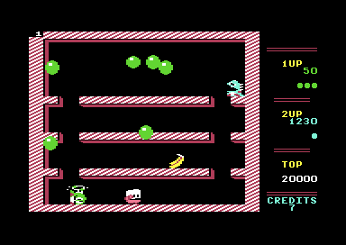
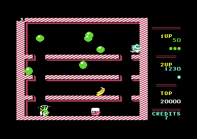
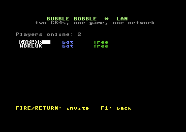
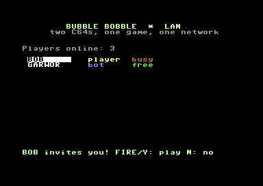
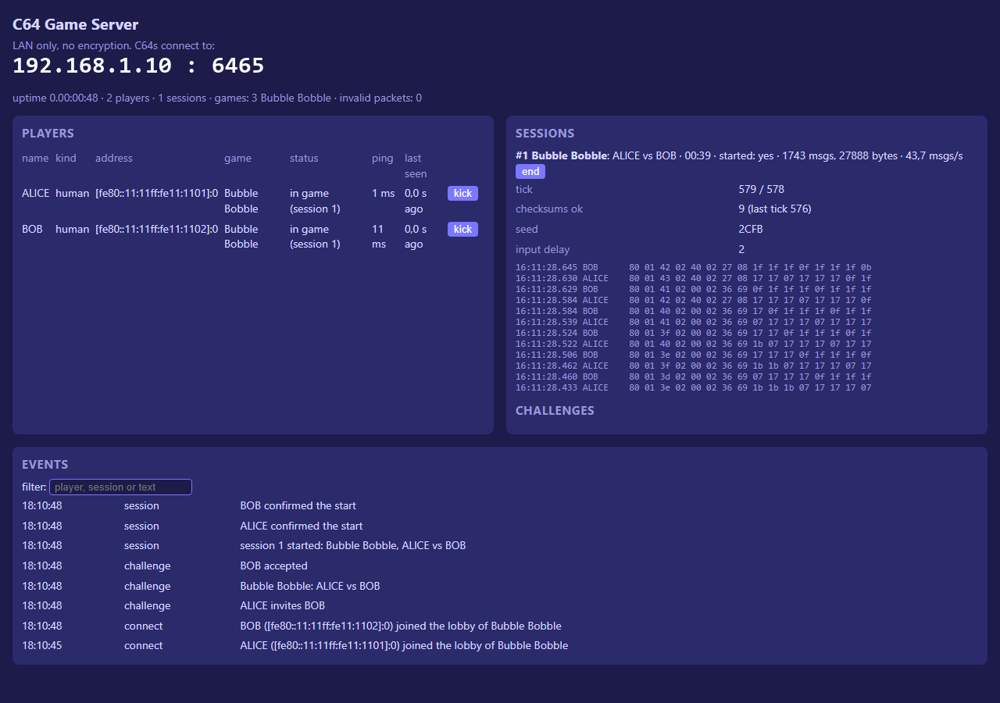

# BB-LAN — Bubble Bobble for two C64s over the LAN

**Bub on one Commodore 64, Bob on another, one game.** BB-LAN turns the C64
version of Bubble Bobble into a two-player network game. Each player uses
their own machine: **VICE**, a **C64 Ultimate / Ultimate 64**, or a C64 with
a **WiC64**, in any combination. A small game server on the LAN brings them
together.

<p align="center">
  
  &nbsp;
  
  <br><em>The same moment of the same game on two emulated C64s.</em>
</p>

## How it works, in one paragraph

Both C64s run the complete, unmodified game logic in **lockstep**. Over the
network go only the joystick inputs, 25 times a second, plus a checksum of the
game state now and then. A tick only runs when the other player's input for
that tick has arrived, so both machines compute exactly the same game. The
server relays the inputs, compares the checksums and runs the lobby. Making the
original game behave identically on two machines took some work; see
[docs/TECHNICAL.md](docs/TECHNICAL.md).

| Lobby | Invited | Server dashboard |
|---|---|---|
|  |  |  |

## What you need

| Player's machine | Network | Notes |
|---|---|---|
| **C64 Ultimate / Ultimate 64** | UDP via the Ultimate Command Interface | Enable *Command Interface* in the Ultimate menu |
| **C64 + WiC64** | TCP via the WiC64 (firmware 2.x) | |
| **VICE 3.9** with WiC64 emulation | TCP | Easiest way to play in an emulator |
| **VICE** with RR-Net | raw Ethernet | Server must run with pcap (Npcap) on the same LAN or PC |

Plus:

- **One PC on the LAN for the game server** (Windows, Linux, Raspberry Pi). It
  needs the .NET 8 runtime. A Raspberry Pi works fine.
- **PAL machines.** The game is PAL only; the lobby refuses NTSC for LAN play.
- **The disk image `bblan.d64`**: `release/bblan.d64`, or build it yourself (see below).

## Quick start

1. **Start the server** on a PC on the LAN:

   ```bash
   cd server
   dotnet run --project src/C64GameServer -c Release
   ```

   It prints the addresses the C64s can use. The dashboard is at
   http://localhost:8080/.

2. **On each C64:** `LOAD "BBLAN",8` and `RUN` (or autostart `bblan.d64` in VICE).

3. **Configure the lobby** with `S` (settings): your name and, for the Ultimate and the WiC64, the server's IP address.
   - VICE with RR-Net needs no address: it finds the server by itself.

4. **Play.** Press `RETURN`. You now see the other players. Pick one with the joystick or the cursor keys and press `FIRE`/`RETURN` to invite them.
   - The other player accepts with `FIRE` or `Y`.
   - Both C64s then load the game. Bub (green) is the player who invited, Bob (blue) the one who accepted.

The complete manual, including VICE setup, Ultimate settings, the server
configuration and troubleshooting, is in **[docs/MANUAL.md](docs/MANUAL.md)**.

## Controls

| Where | Key / joystick | Action |
|---|---|---|
| Menu | `F1` / `RETURN` | Play on the LAN |
| Menu | `L` | Local game, two joysticks, as the original |
| Menu | `S` | Settings |
| Lobby | joystick up/down or cursor keys | Choose a player |
| Lobby | `FIRE` / `RETURN` | Invite |
| Lobby | `N` | Withdraw or decline an invitation |
| Lobby | `F1` | Back to the menu |
| Game | joystick in **port 2** | Move, jump, blow bubbles |
| Game | `C=` | Pause (both machines) |
| Game | `Q` | Quit the game (both machines) |

## Building from source

You need Python 3, [cc65](https://cc65.github.io/) (ca65/ld65/cl65), VICE
(`c1541` for the disk image) and the .NET 8 SDK for the server.

```bash
python tools/build.py disk      # build/bblan.d64: lobby + game files
python tools/build.py verify    # the original game, byte-identical (SHA256 check)
dotnet test server/tests/C64GameServer.Tests
```

`tools/build.py` finds cc65 via `$CC65_HOME`, `../c64/cc65` or the `PATH`, and VICE via `$VICE_DIR` or `../c64/vice/bin`.

Tests (they start VICE instances, minimized):

```bash
python tools/dettest.py         # determinism: PAL/NTSC/jitter/stalls give identical checksums
python tools/soak.py 300 8      # a bot plays from level 8; reports crashes and hangs
python tools/nettest.py 120     # server + two VICEs (RR-Net), complete LAN session
python tools/nettest.py 120 --wic64   # the same with VICE's WiC64 emulation
```

## Project layout

| Path | Contents |
|---|---|
| `src/` | The game: the reconstructed source of the C64 version (ca65), plus `bblan.s` (deterministic tick core) and `bbnet.s` (lockstep and network drivers) |
| `lobby/` | The lobby program (C with cc65, drivers in assembly) |
| `server/` | The game server (C#/.NET 8): lobby, sessions, relay, checksums, dashboard; UDP, TCP and raw Ethernet |
| `tools/` | Build, packer, test and debug tools |
| `docs/` | Manual, technical description, plan (Dutch), images |

## Credits and license

- The game source is based on **[rebb64](https://github.com/zaidka/rebb64)** by zaidka, a reconstruction of the C64 version that builds byte for byte identical to the original. Its README and technical notes are in [docs/REBB64-README.md](docs/REBB64-README.md) and [docs/REBB64-TECHNICAL.md](docs/REBB64-TECHNICAL.md).
- **Bubble Bobble** © 1986 Taito Corporation. The C64 version is by Software Creations and was published by Firebird. This is a non-commercial fan project; all rights to the game stay with their owners.
- The game server started as the server of the **WoW-LAN** project (Wizard of Wor over the LAN).
- The WiC64 protocol follows the WiC64 team's [wic64-library](https://github.com/WiC64-Team/wic64-library).
- The CS8900a set-up follows [ip65](https://github.com/cc65/ip65) (Mozilla Public License 1.1, see [third_party/ip65-LICENSE.txt](third_party/ip65-LICENSE.txt)).
