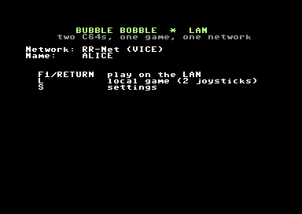

# BB-LAN manual

This manual covers everything needed to play Bubble Bobble with two C64s over a local network:

- the game server;
- setting up each kind of C64 (C64 Ultimate / Ultimate 64, WiC64, VICE);
- the lobby and the game itself;
- what to do when something does not work.

* [1. What is on the disk](#1-what-is-on-the-disk)
* [2. The game server](#2-the-game-server)
* [3. C64 Ultimate / Ultimate 64](#3-c64-ultimate--ultimate-64)
* [4. C64 with WiC64](#4-c64-with-wic64)
* [5. VICE](#5-vice)
* [6. The lobby](#6-the-lobby)
* [7. Playing](#7-playing)
* [8. Troubleshooting](#8-troubleshooting)
* [9. Limitations](#9-limitations)

---

## 1. What is on the disk

`bblan.d64` contains four files:

| File | What it is |
|---|---|
| `BBLAN` | The lobby. Load and run this one. |
| `BBU` | The game, network driver for the Ultimate |
| `BBW` | The game, network driver for the WiC64 |
| `BBR` | The game, network driver for RR-Net (VICE) |

You only ever start `BBLAN`:

- It detects the network hardware and loads the matching game file when a game starts.
- After the game it loads `BBLAN` again, shows how the game ended and reconnects to the server.

The lobby saves its settings in `BBLAN.CFG` on the same disk, so the disk must be writable.

Every game starts from a freshly loaded game file. That is deliberate: both C64s must start from exactly the same state (see [TECHNICAL.md](TECHNICAL.md)).

## 2. The game server

The server is a small .NET 8 program. It:

- runs the lobby;
- pairs the players;
- relays their inputs;
- compares the game state checksums of the two C64s.

It needs very little CPU; a Raspberry Pi is plenty.

### Running it

Install the [.NET 8 runtime or SDK](https://dotnet.microsoft.com/download/dotnet/8.0), then:

```bash
cd server
dotnet run --project src/C64GameServer -c Release
```

Or build stand-alone executables once with `server/publish.bat`. They are written to `publish/win-x64/` and `publish/linux-arm64/` (Raspberry Pi with a 64-bit OS).

At start-up the server prints the IP addresses of the PC. Use the LAN address (for example `192.168.1.10`) in the C64s' settings. The **dashboard** at `http://<server>:8080/` shows:

- the players and sessions;
- the current tick of each C64 and the number of compared checksums;
- an event log.

From the dashboard you can also kick a player or end a session.

> The server is meant for a LAN only. Its traffic is not encrypted or
> authenticated: do not forward its ports to the internet.

### Ports and firewall

| Port | Protocol | For |
|---|---|---|
| 6465 | UDP | C64 Ultimate / Ultimate 64 |
| 6466 | TCP | WiC64 (real and in VICE) |
| raw Ethernet, EtherType `0x88B5` | pcap | VICE with RR-Net |
| 8080 | TCP | Dashboard (browser) |

On Windows, allow `C64GameServer` through the firewall for private networks when Windows asks.

### server.json

The server reads `server.json` from its working directory. If the file is missing, it writes one with the defaults. You can also pass another path as the first argument.

```json
{
  "gamePort": 6465,
  "tcpPort": 6466,
  "dashboardPort": 8080,
  "pcapInterface": "",
  "pcapMac": "02:BB:4C:41:4E:01",
  "bots": [],
  "games": [
    { "id": 3, "name": "Bubble Bobble", "module": "bubblebobble", "version": 1,
      "settings": { "inputDelay": 2, "inputDelayWiC64": 4,
                    "inputTimeoutSeconds": 10, "loadTimeoutSeconds": 150 } }
  ]
}
```

| Setting | Meaning |
|---|---|
| `gamePort` | UDP port (Ultimate) |
| `tcpPort` | TCP port for the WiC64; `0` turns it off |
| `pcapInterface` | Network interface for raw Ethernet (VICE RR-Net); empty = off. See below |
| `pcapMac` | The server's MAC address on the raw Ethernet side (a locally administered address; keep the default) |
| `inputDelay` | Ticks between pressing the joystick and the game reacting (1-4, a tick is 40 ms). 2 = 80 ms, plenty for a LAN |
| `inputDelayWiC64` | The same when a WiC64 takes part. Every WiC64 transfer costs the C64 time, so a longer delay lets one transfer bring several ticks of input |
| `inputTimeoutSeconds` | A player who sends nothing for this long during the game ends the session |
| `loadTimeoutSeconds` | How long a C64 may take to load the game after the start (a real 1541 needs about a minute) |
| `bots` | Built-in bots that accept every challenge (for the Wizard of Wor game; not useful for Bubble Bobble, keep empty) |

Other settings:

- `idleTimeoutSeconds`, `challengeTimeoutSeconds`, `lobbyIntervalMs`, and so on. They keep their defaults; see `server/src/C64GameServer.Core/Core/ServerConfig.cs`.
- The `games` list can also hold the other games of the platform (Wizard of Wor, id 1). The lobby of BB-LAN only shows Bubble Bobble players.

### Raw Ethernet for VICE with RR-Net

VICE puts its emulated RR-Net card on a host network adapter using pcap. That way it usually cannot reach a normal UDP server *on the same PC*. So the server can speak raw Ethernet itself, on the same adapter.

1. **Windows:** install [Npcap](https://npcap.com/). **Linux:** install `libpcap` (`sudo apt install libpcap0.8`). The server needs the right to capture, so run it as root or give it `cap_net_raw`.
2. List the adapters:

   ```bash
   dotnet run --project src/C64GameServer -c Release -- --list-interfaces
   ```

3. Put the adapter's name in `pcapInterface`. On Windows it looks like `\\Device\\NPF_{BD187BD7-...}`; in JSON, double every backslash. On Linux it is something like `eth0`.

All VICEs and the server must use **the same adapter**:

- A wired adapter works best.
- Frames with made-up MAC addresses usually do not pass through Wi-Fi to *other* PCs.
- On one PC, Wi-Fi works fine.

The C64s find the server by a broadcast; no IP addresses are involved.

## 3. C64 Ultimate / Ultimate 64

1. In the Ultimate menu (F2), enable the **Command Interface**:
   - *C64 and Cartridge Settings → Command Interface: Enabled*
   - The exact place depends on the firmware version.
2. Connect the Ultimate to the network (LAN or Wi-Fi) and check that it has an IP address (*Network settings*).
3. Copy `bblan.d64` to the USB stick or SD card. Mount it on drive A (8) and run `BBLAN` (`LOAD"BBLAN",8` + `RUN`).
4. In the lobby, press `S` and enter your name and the server's IP address.

The menu then shows `Network: Ultimate, IP ...`.

The Ultimate's emulated 1541 loads the 46 KB game at normal 1541 speed (about a minute). Turn on the Ultimate's fast loader for a quicker start. The server waits up to `loadTimeoutSeconds` (150 s) for each C64.

## 4. C64 with WiC64

1. The WiC64 needs **firmware 2.0 or newer**. Update via the WiC64 portal if needed.
2. Connect it to your Wi-Fi with the WiC64's own setup program.
3. Load `BBLAN` from a disk drive, SD2IEC or similar.
4. In the lobby, press `S` and enter your name and the server's IP address. The WiC64 connects to the server's TCP port (6466).

The menu shows `Network: WiC64, IP ...`.

## 5. VICE

Use **x64sc** from VICE 3.9 or newer, in PAL mode (the default).

To make the game load in seconds instead of a minute, turn off true drive emulation:

- *Settings → Peripheral devices → Drive → True drive emulation*: off
- together with *Virtual device traps*: on
- or on the command line: `+drive8truedrive -virtualdev8`

### VICE with the WiC64 emulation (simplest)

- *Settings → Peripheral devices → Userport device: WiC64*, or `-userportdevice 23`.
- VICE connects to the server through the PC's normal network. If the server runs on the same PC, the server address is `127.0.0.1`.

```bash
x64sc -userportdevice 23 +drive8truedrive -virtualdev8 -autostart bblan.d64
```

### VICE with RR-Net

- *Settings → I/O extensions → Ethernet cartridge*:
  - enable it;
  - mode **RR-Net**;
  - choose the network adapter, the same one as the server's `pcapInterface`.
- On Windows this needs Npcap.

```bash
x64sc -ethernetcart -ethernetcartmode 1 -ethernetioif "\Device\NPF_{...}" +drive8truedrive -virtualdev8 -autostart bblan.d64
```

Two VICEs and the server on one PC work fine this way. Each VICE needs its own copy of `bblan.d64`, because the lobby makes up a MAC address and saves it in `BBLAN.CFG`. Two C64s with the same MAC would not work.

## 6. The lobby



The menu shows the network hardware that was found and your name:

- `F1`/`RETURN` connects to the server.
- `L` starts a local game for two players on one C64 (two joysticks), as in the original.
- `S` opens the settings.

The first time, you are asked for your name and (Ultimate, WiC64) the server's address:

- Names are 1-8 characters: letters and digits.
- `RETURN` on an empty line keeps the old value.


After connecting you see the other Bubble Bobble players on the server:

| Status | Meaning |
|---|---|
| *free* | can be invited |
| *busy* | is invited or invites someone |
| *playing* | is in a game |

To invite a player, move to them with the joystick (port 2) or the cursor keys and press `FIRE` or `RETURN`. `N` withdraws the invitation.


When you are invited, the bottom line shows who invited you:

- `FIRE` or `Y` accepts.
- `N` declines.

Then both C64s load the game. The screen shows which dragon you play:

- **Bub** (green, player 1): the player who invited.
- **Bob** (blue, player 2): the player who accepted.

After the game the lobby is loaded again. It shows how the game ended and connects to the server by itself. The possible endings:

| Message | Meaning |
|---|---|
| game over | both dragons lost their lives, or a player pressed `Q` |
| your opponent left | the other C64 disconnected |
| timeout - no answer | the other C64 sent nothing for 10 seconds (or did not start the game in time) |
| desync - the C64s disagreed | the two C64s computed different game states (should not happen; please report it) |
| ended by the server | someone ended the session on the dashboard |

### BBLAN.CFG

The lobby writes this file itself. You can also put it on the disk by hand (a SEQ file, lines `KEY=VALUE`):

| Key | Meaning |
|---|---|
| `NAME` | Your name |
| `SERVER` | IP address of the server (Ultimate, WiC64) |
| `MAC` | RR-Net MAC address, 12 hex digits (made up by the lobby) |
| `AUTO` | Tests: `I` invites the first free player automatically, `A` accepts every invitation |
| `BOT` | Tests: `1` lets a simple bot play instead of the joystick (only in the test build of the game) |

## 7. Playing

Each player uses the joystick in **port 2** of their own C64. It controls their own dragon; the other dragon is controlled from the other C64.

The game is the original C64 Bubble Bobble, including:

- the levels and enemies;
- the bonus rounds;
- the hurry-up and Baron von Blubba;
- the EXTEND letters.

Both C64s run all of it in step, so each player sees exactly the same game.

- **Pause:** `C=` pauses the game on both C64s, and `C=` again continues.
- **Quit:** `Q` ends the game on both C64s; both return to the lobby.
- **Joining again:** a dragon that lost all its lives can come back with `FIRE`, as in the original, as long as the other dragon is still alive.
- **Game over:** when both dragons have lost all their lives, both C64s return to the lobby.

When the network is slow, the game waits for the other C64. That shows as a short stutter. If it waits for more than about 5 seconds, the border flashes; after 10 seconds without input from the other side the game ends.

## 8. Troubleshooting

**"Network: none found"**

- *Ultimate:* the Command Interface is disabled (see [3](#3-c64-ultimate--ultimate-64)).
- *WiC64:* check the cable, the firmware (2.x) and that the WiC64 works with its own programs.
- *VICE:* the userport device (WiC64) or the Ethernet cartridge (RR-Net) is not enabled.

**"No answer from the server, trying again..." / the dots keep coming**

- *Ultimate, WiC64:* check the server address and the firewall (UDP 6465, TCP 6466). Check that the server is running.
- *VICE RR-Net:*
  - The server must have `pcapInterface` set to the same adapter as VICE.
  - Is Npcap installed?
  - Over Wi-Fi, frames from made-up MAC addresses usually do not reach other PCs: use a cable, or run the server on the same PC.

**"That name is already in use."**

Another C64 uses that name. Choose another one with `S`.

**The game does not start after accepting ("timeout")**

The other C64 did not load the game within `loadTimeoutSeconds`:

- Loading from a real 1541 takes about a minute; make sure nothing else slows it down.
- Check that all files are on the disk: `BBU`, `BBW`, `BBR`.

**"desync"**

The two C64s computed different games. This means a bug. Possible causes:

- an NTSC machine took part;
- the two disks have different versions of the game files.

Please report it with the server log (`server.log`).

**VICE loads the game very slowly**

Turn off true drive emulation (see [5](#5-vice)).

**The game runs slower than the original on a real C64?**

It should not. BB-LAN keeps the original's frame timing; the game only waits when the other C64's input is late.

## 9. Limitations

- Two players, co-operative, as the original. There is no versus mode.
- PAL only. NTSC C64s cannot take part in LAN games.
- LAN only: the inputs travel through the server, and the timing is made for a local network.
- The server does not know the game: it relays and compares checksums. A changed game file on one side shows up as a desync.
