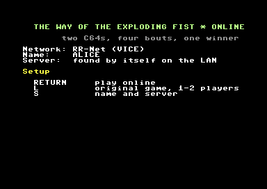

# The Way of the Exploding Fist OME: two C64s, four bouts, one winner

> Part of the **[Commodore 64 Game Server](../../README.md)**: one server, a shared framework and several *Online Multiplayer Enabled* C64 games.

**The Way of the Exploding Fist** (Beam Software / Melbourne House, 1985) for two
players, each on their **own Commodore 64**: a C64 Ultimate, a C64 with a WiC64, or
VICE. The original game, with the framework's standard lobby in front of it
instead of the boot picture and the scream.

<p align="center">
  
  &nbsp;
  
  <br><em>The same bout on two emulated C64s, a moment apart.</em>
</p>

| Lobby | Invited | Setup (F1) |
|---|---|---|
|  |  |  |

## Playing

1. Start the [game server](../../server/README.md), or use someone else's (`RELEASE/start-server.bat`).
2. Start the disk `RELEASE/games/explodingfist.d64` on each C64. In VICE: `RELEASE/vice-wic64.bat`, game 3.
3. The first start asks for your name and, for the Ultimate and the WiC64, the server's IP address.
   - C64 Ultimate: first enable the [Command Interface](../../README.md#c64-ultimate-turn-on-the-command-interface).
   - Later starts go straight to the lobby.
4. Choose an opponent, a person or a bot (BRUCE, CHUCK), and press FIRE. The other accepts with FIRE or Y.
5. Both C64s load the game and play the original **two-player match: four bouts**, one per backdrop.
   - The player who invited is **white** (left), the one who accepted is **red** (right).
   - Each player uses **joystick port 2** on their own C64.
   - **Q** ends the match for both.
6. After the match both C64s go back to the lobby.

In the lobby, **F1** opens the setup (name, server), and **L** starts the original game on one
C64 (one player against the computer, or two players with two joysticks).

## How it was done

There is no source code of the game. The base is the **RAM image** that the
game's own loader leaves at the moment it jumps into the game (`JMP $1158`):

- `tools/snapshot.py` runs the clean disk (`orig/exploding_fist.d64`) in VICE and saves all 64 KB at that moment (`orig/fist-1158.bin`).
- Our changes are **patches** to that image, written in ca65 (`src/main.s`). `tools/build.py` assembles them and checks that they only touch the areas listed in `src/areas.json`.
- The framework's packer makes one self-extracting file of it per network type.
- The boot picture, the scream, the loader and the copy protection are not part of it.

What the patches do:

| Where | What |
|---|---|
| `$C000` (entry) | Restores zero page and pages 1-3 as they were at the snapshot (the lobby left its own), so every C64 starts from exactly the same state. Then a session, or the original game |
| `$15AA` | The bout loop's wait for raster line `$FD` (once per pass) becomes the **tick**: first the original wait, then the input exchange (`net_step`) |
| `$2270` | The joystick read of each fighter becomes the tick's input of that fighter |
| `$15C4` | The keyboard (F5 aborts) becomes the network's Q key |
| `$191C`, `$193C`, `$1C79` | Waits between bouts (walking back, the judge): they keep the network alive (`net_idle`) |
| `$28A5` | The NMI (the floor colour) keeps the WiC64's handshake bit |
| `$F540-$FF3F` | New code: the session flow and the framework's network code ([framework/c64/net](../../framework/c64/net/net.s)). These are the floor rows of the bitmap, yellow on yellow: their bytes are never seen, and the game never touches them (checked with VICE watchpoints) |

### Determinism

`tools/dettest.py` plays a whole match (6200 ticks, four bouts) with a bot on both
fighters in three VICEs with different timing:
- PAL;
- NTSC;
- PAL with 0-3 frames of random waiting per tick, as a network causes.

Then it compares all RAM. Only the display and the music differ, because they run per frame in the IRQ: sprite multiplexer, raster lines, the music driver's variables. The game state is identical.

So the checksum covers:
- zero page `$34-$F8`: both fighters, the judge, the bout, the random generator `$8E`;
- the score line `$CC00-$CC4F`, because the score only exists as screen digits.

The random generator is seeded from the session's seed.

### Speed

The game ticks once per pass of its bout loop, about 46 times a second.

| Set-up | Ticks per second |
|---|---|
| No network | about 46 |
| VICE ↔ VICE over RR-Net | about 32 |
| VICE ↔ VICE over the WiC64 emulation | about 18 (each WiC64 transfer costs frames; a WiC64 sends every 4th tick) |
| VICE against a server bot | about 38 |
| Real C64 Ultimate / WiC64 | not yet tested |

## Building

```bash
python tools/build.py disk        # build/fist.d64: the lobby + fistu / fistw / fistr
python tools/build.py testdisk    # build/fist-test.d64: the same with a test bot
python tools/dettest.py 6200      # determinism (three VICEs)
python ../../framework/tools/nettest.py . 120 [--wic64] [--bot]   # server + VICEs
python tools/screenshots.py       # docs/images
python tools/snapshot.py          # only to make orig/fist-1158.bin again
```

| Path | Contents |
|---|---|
| `orig/` | The clean disk and the RAM image at `JMP $1158` (with its hash) |
| `src/main.s` | All patches and the session code |
| `src/netgame.inc` | Settings for the framework's network code (lobby name, checksum areas) |
| `src/areas.json` | Where patches may go |
| `lobby/game.h` | Settings for the standard lobby |
| `tools/` | Build, snapshot, determinism test, screenshots |

## Credits

**The Way of the Exploding Fist** © 1985 Beam Software / Melbourne House. This is
a non-commercial fan project; all rights to the game stay with their owners.
The disk image in `RELEASE/` contains the game. The network code, the lobby and
the tools are original work of this project.

The analysis by [Games Explained](https://github.com/gamesexplained/gamesexplained/tree/main/games/c64/way-of-the-exploding-fist)
(of another version of the game) helped to find the way around.
