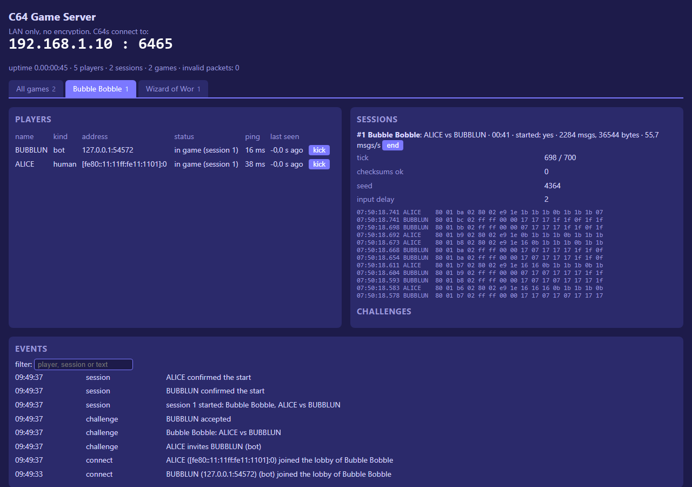

# C64 Game Server: the server

The server that C64s connect to for online two-player games. One server hosts
every game of this repository at the same time:

- a lobby per game, with people and bots;
- invitations and sessions;
- relaying of the inputs and comparing of the checksums;
- a web dashboard with one tab per game.

It is not authoritative: the C64s run the game in lockstep. An overview of the
whole project is in the [main README](../README.md); the protocol is in
[docs/protocol.md](../docs/protocol.md).

> **LAN only.** There is no encryption, account or password. Never forward
> its ports to the internet.

## Running

```bash
dotnet run --project src/C64GameServer -c Release
```

This needs the .NET 8 SDK. Without .NET, build stand-alone programs once with
`publish.bat`. It writes `publish\win-x64` and `publish\linux-arm64` (a
Raspberry Pi with a 64-bit OS), each with `C64GameServer` and `C64Bot`.

At the first start the server writes `server.json` with the defaults. It prints
the IP addresses the C64s can use and the bots it started.

- The dashboard is at `http://localhost:8080/`.
- Ctrl+C stops the server.
- `C64GameServer other.json` uses another configuration file.
- `C64GameServer --list-interfaces` lists the network adapters for raw Ethernet.

## Transports

| C64 | Transport | Setting |
|---|---|---|
| C64 Ultimate / Ultimate 64; VICE RR-Net with ip65 (Wizard of Wor) | UDP | `gamePort` (6465) |
| WiC64 (firmware 2.x, real or VICE) | TCP, messages framed as `[length][message]` | `tcpPort` (6466, `0` = off) |
| VICE with RR-Net (Bubble Bobble) | raw Ethernet, EtherType `0x88B5`, via pcap | `pcapInterface` (empty = off) |

### Raw Ethernet (VICE with RR-Net)

VICE puts its emulated RR-Net on a host network adapter through pcap. That way
it usually cannot reach a UDP server *on the same PC*. So the server can speak
raw Ethernet itself, on the same adapter:

1. **Windows:** install [Npcap](https://npcap.com/).
   **Linux:** `sudo apt install libpcap0.8`, and run as root or with `cap_net_raw`.
2. List the adapters with `--list-interfaces`.
3. Put the adapter's name in `pcapInterface`:
   - Windows: `\\Device\\NPF_{...}` (double every backslash in JSON);
   - Linux: for example `eth0`.

The server answers with its own MAC address, `pcapMac`. The C64s find it with a
broadcast. A wired adapter works best: Wi-Fi rarely passes frames with
made-up MAC addresses to *other* PCs. On one PC, Wi-Fi works.

## Firewall (Windows)

Allow private networks when Windows asks, or add the rules yourself (as administrator):

```bash
netsh advfirewall firewall add rule name="C64 Game Server (UDP)" dir=in action=allow protocol=UDP localport=6465
```

```bash
netsh advfirewall firewall add rule name="C64 Game Server (TCP)" dir=in action=allow protocol=TCP localport=6466,8080
```

## server.json

```json
{
  "gamePort": 6465,
  "tcpPort": 6466,
  "dashboardPort": 8080,
  "pcapInterface": "",
  "pcapMac": "02:BB:4C:41:4E:01",
  "logFile": "server.log",
  "games": [
    { "id": 1, "name": "Wizard of Wor", "module": "wizardofwor", "version": 1,
      "bots": ["WORLUK", "GARWOR", "THORWOR"] },
    { "id": 3, "name": "Bubble Bobble", "module": "bubblebobble", "version": 1,
      "bots": ["BUBBLUN", "BOBBLUN"],
      "settings": { "inputDelay": 2, "inputDelayWiC64": 4,
                    "inputTimeoutSeconds": 10, "loadTimeoutSeconds": 150 } },
    { "id": 4, "name": "Exploding Fist", "module": "lockstep", "version": 1,
      "bots": ["BRUCE", "CHUCK"],
      "settings": { "inputDelay": 3, "inputDelayWiC64": 4,
                    "inputTimeoutSeconds": 20, "loadTimeoutSeconds": 150 } },
    { "id": 2, "name": "Relay demo", "module": "relay", "version": 1 }
  ]
}
```

| Setting | Meaning |
|---|---|
| `gamePort`, `tcpPort`, `dashboardPort` | Ports: UDP, TCP (WiC64), web dashboard |
| `pcapInterface`, `pcapMac` | Raw Ethernet: the adapter, and the server's MAC (a locally administered address; keep the default) |
| `logFile` | Event log on disk |
| `games[].id`, `version` | Must match the HELLO of the game's C64 program |
| `games[].module` | `wizardofwor`, `lockstep` (games on the framework's network code: Bubble Bobble, Exploding Fist; `bubblebobble` is the same), or `relay` (any other game: forwards unchanged, no code needed) |
| `games[].bots` | Built-in bots for this game: A-Z/0-9, at most 8 characters. They are in the lobby and accept every challenge |
| `games[].settings` | Settings of the module, see below |
| `bots`, `botGame` | Older form: bots for one game. Prefer `games[].bots` |

Other settings, such as `idleTimeoutSeconds`, `challengeTimeoutSeconds`,
`lobbyIntervalMs` and `autoPair`, keep their defaults. See
`src/C64GameServer.Core/Core/ServerConfig.cs`.

### Module settings

**Bubble Bobble** and **Exploding Fist** (`lockstep`):

| Setting | Default | Meaning |
|---|---|---|
| `inputDelay` | 2 | Ticks between the joystick and the game reacting (1-4; a tick is 40 ms) |
| `inputDelayWiC64` | 4 | The same when a WiC64 takes part. Each transfer costs the C64 time, so a longer delay lets one transfer carry several ticks |
| `inputTimeoutSeconds` | 10 | A player who sends nothing for this long during the game ends the session |
| `loadTimeoutSeconds` | 150 | How long a C64 may take to load the game after START (a real 1541 needs about a minute) |

**Wizard of Wor** (`wizardofwor`):

| Setting | Default | Meaning |
|---|---|---|
| `inputDelay` | 4 | Ticks between the joystick and the game reacting (a tick is 1/60 s) |
| `inputDelayWiC64` | 8 | The same when a WiC64 takes part (it sends only every 4th tick) |
| `tickRate` | 60 | Ticks per second, sent in START |
| `inputTimeoutSeconds` | 10 | A player who sends nothing for this long during the game ends the session |

## The dashboard

`http://<server>:8080/`:

- an **All games** tab, plus **one tab per game** in `games`. A new game gets a new tab by itself;
- per game: its players (person or bot, address, status, ping), sessions (tick, checksums, traffic, the latest messages), challenges and events;
- **kick** a player, **end** a session;
- `/api/status` gives the same as JSON. `/?static` shows one snapshot without live updates, for screenshots.



## The test bot

`C64Bot` plays like a C64: it connects, accepts or invites, and plays lockstep
by the game's `BotProfile`. The server's built-in bots are the same code.

```bash
C64Bot --server 192.168.1.10 --nick ANNA --game 1 --invite WORLUK
```

Other options: `--games N`, `--ticks N`, `--loss PERCENT`, `--bad-checksum-at TICK`,
`--quit-at TICK`, `--decline`, `--no-checksum`, `--human`, `--quiet`.

## Tests

```bash
dotnet test tests/C64GameServer.Tests
```

The tests drive the core with a fake clock and a fake transport. They cover the
lobby, invitations, sessions, timeouts, checksums, the game modules and fuzzing.
`python build.py test` in the repository root runs them together with the game tests.

## Source

| Path | Contents |
|---|---|
| `src/C64GameServer.Core/Core` | `ServerCore` (lobby, sessions, timeouts), `ServerConfig`, `EventLog`, model |
| `src/C64GameServer.Core/Protocol` | Messages |
| `src/C64GameServer.Core/Games` | Game modules and `GameRegistry` |
| `src/C64GameServer.Core/Bots` | `BotClient`, `BotProfile` |
| `src/C64GameServer` | Program, transports (UDP, TCP, pcap), dashboard |
| `src/C64Bot` | The stand-alone bot |
| `tests/C64GameServer.Tests` | Unit tests |

To add a game, see [docs/adding-a-game.md](../docs/adding-a-game.md).
